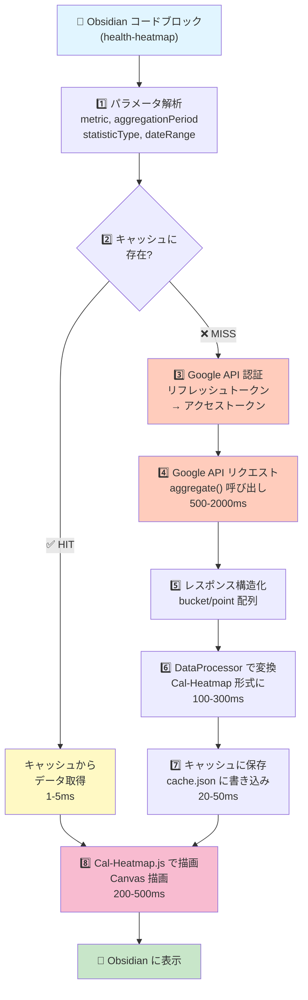
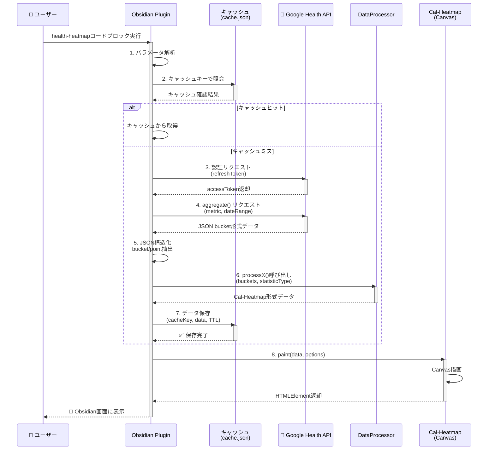

# Google Health API 時系列データ可視化プラグイン

## 概要
Obsidian プラグインで Google Health API から取得した健康データを Cal-Heatmap.js で可視化する。
※ Fitbit API は 2026年9月に廃止予定のため、Google Health API へ移行しました。

## アーキテクチャ構成

### 1. プラグイン構成
```
health-api-heatmap-plugin/
├── src/
│   ├── main.ts                 # プラグインメインエントリーポイント
│   ├── settings.ts             # 設定ページ・Google API キー管理
│   ├── api/
│   │   └── googleHealthClient.ts  # Google Health API クライアント
│   ├── data/
│   │   └── dataProcessor.ts    # データ取得・変換処理
│   └── ui/
│       ├── heatmapView.ts      # Cal-Heatmap UI コンポーネント
│       └── heatmapBlock.ts     # コードブロック (`​`​`health-heatmap`​`​`)
├── manifest.json
├── package.json
├── tsconfig.json
├── esbuild.config.mjs
└── .env.example
```

### 2. 主要機能

#### 2.1 認証・設定管理
- **Google OAuth 2.0 認証フロー**
  - Google Cloud Console でプロジェクト作成・API 有効化
  - プラグイン設定画面でクライアント ID/シークレットを入力
  - スコープ: `https://www.googleapis.com/auth/fitness.activity.read` 等

- **認証情報の保存方法**
  - **クライアント ID/シークレット**:
    - Obsidian の `plugin.saveData()` で暗号化保存
    - データディレクトリ: `.obsidian/plugins/health-api-heatmap-plugin/data.json`
  - **アクセストークン/リフレッシュトークン**:
    - 同じく暗号化保存（メモリ内での保持も検討）
    - トークン有効期限管理・自動リフレッシュ

- **設定画面での表示方針**
  - ❌ **シークレットは表示しない**: セキュリティリスク
  - ✅ **クライアント ID のみ表示**: 一意の識別用として表示
  - ✅ **「設定済み」状態表示**: 現在設定されているかを示す
  - ✅ **「変更」ボタン**: 既存設定を上書きできるオプション
  - ✅ **マスク表示オプション**: クライアント ID の一部を `****` で隠す

#### 2.2 データ取得
- **Google Health API エンドポイント**
  - `POST /fitness/v1/users/me/dataset:aggregate` (集計データ取得)
  - リクエストで `bucketByTime` パラメータで集計期間を指定可能

- **集計期間の指定オプション**
  - `bucketByTime.duration`: ナノ秒単位 (例: 3600000000000 = 1時間)
  - または `bucketByTime.durationMillis`: ミリ秒単位 (例: 3600000 = 1時間)
  - デフォルト: 86400000ミリ秒（1日）

- **データ型とサンプルレスポンス**

##### 1️⃣ ステップ数 (`com.google.step_count.delta`)

**日次集計（デフォルト）:**
```json
{
  "bucket": [{
    "startTimeMillis": "1719792000000",
    "endTimeMillis": "1719878400000",
    "dataset": [{
      "dataSourceId": "derived:com.google.step_count.delta:com.google.android.gms:estimated_steps",
      "point": [{
        "startTimeNanos": "1719792000000000000",
        "endTimeNanos": "1719878400000000000",
        "value": [{"intVal": 8543}]
      }]
    }]
  }]
}
```
**データ形式**: 日次合計ステップ数（整数値）

**1時間ごとの集計:**
```json
{
  "bucket": [
    {
      "startTimeMillis": "1719792000000",
      "endTimeMillis": "1719795600000",
      "dataset": [{
        "dataSourceId": "derived:com.google.step_count.delta:com.google.android.gms:estimated_steps",
        "point": [{
          "startTimeNanos": "1719792000000000000",
          "endTimeNanos": "1719795600000000000",
          "value": [{"intVal": 543}]
        }]
      }]
    },
    {
      "startTimeMillis": "1719795600000",
      "endTimeMillis": "1719799200000",
      "dataset": [{
        "dataSourceId": "derived:com.google.step_count.delta:com.google.android.gms:estimated_steps",
        "point": [{
          "startTimeNanos": "1719795600000000000",
          "endTimeNanos": "1719799200000000000",
          "value": [{"intVal": 621}]
        }]
      }]
    }
  ]
}
```
**データ形式**: 1時間ごとのステップ数（複数バケット）

**API リクエスト例（1時間集計）:**
```json
{
  "aggregateBy": [{
    "dataTypeName": "com.google.step_count.delta"
  }],
  "bucketByTime": {
    "durationMillis": 3600000
  },
  "startTimeMillis": "1719792000000",
  "endTimeMillis": "1719878400000"
}
```

##### 2️⃣ 心拍数 (`com.google.heart_rate.bpm`)

**日次集計（複数の測定値）:**
```json
{
  "bucket": [{
    "startTimeMillis": "1719792000000",
    "endTimeMillis": "1719878400000",
    "dataset": [{
      "dataSourceId": "derived:com.google.heart_rate.bpm:com.google.android.gms:samsung_gear",
      "point": [
        {
          "startTimeNanos": "1719810000000000000",
          "endTimeNanos": "1719810060000000000",
          "value": [{"fpVal": 72.5}]
        },
        {
          "startTimeNanos": "1719820000000000000",
          "endTimeNanos": "1719820060000000000",
          "value": [{"fpVal": 68.3}]
        },
        {
          "startTimeNanos": "1719830000000000000",
          "endTimeNanos": "1719830060000000000",
          "value": [{"fpVal": 75.8}]
        },
        {
          "startTimeNanos": "1719840000000000000",
          "endTimeNanos": "1719840060000000000",
          "value": [{"fpVal": 71.2}]
        }
      ]
    }]
  }]
}
```
**データ形式**: 複数の時点での測定値（分単位）
- min: 68.3 bpm
- avg: 71.95 bpm
- max: 75.8 bpm

**1時間ごとの集計（詳細）:**
```json
{
  "bucket": [
    {
      "startTimeMillis": "1719792000000",
      "endTimeMillis": "1719795600000",
      "dataset": [{
        "dataSourceId": "derived:com.google.heart_rate.bpm:com.google.android.gms:samsung_gear",
        "point": [
          {
            "startTimeNanos": "1719792000000000000",
            "endTimeNanos": "1719792300000000000",
            "value": [{"fpVal": 70.2}]
          },
          {
            "startTimeNanos": "1719792300000000000",
            "endTimeNanos": "1719792600000000000",
            "value": [{"fpVal": 72.5}]
          },
          {
            "startTimeNanos": "1719793000000000000",
            "endTimeNanos": "1719793300000000000",
            "value": [{"fpVal": 68.9}]
          }
        ]
      }]
    },
    {
      "startTimeMillis": "1719795600000",
      "endTimeMillis": "1719799200000",
      "dataset": [{
        "dataSourceId": "derived:com.google.heart_rate.bpm:com.google.android.gms:samsung_gear",
        "point": [
          {
            "startTimeNanos": "1719795600000000000",
            "endTimeNanos": "1719795900000000000",
            "value": [{"fpVal": 74.1}]
          },
          {
            "startTimeNanos": "1719796200000000000",
            "endTimeNanos": "1719796500000000000",
            "value": [{"fpVal": 76.3}]
          }
        ]
      }]
    }
  ]
}
```
**データ形式**: 1時間ごと、各バケット内に複数の測定値
- 1時間目: min=68.9, avg=70.53, max=72.5
- 2時間目: min=74.1, avg=75.2, max=76.3

##### 3️⃣ 消費カロリー (`com.google.calories.expended`)

**日次集計（複数の測定値）:**
```json
{
  "bucket": [{
    "startTimeMillis": "1719792000000",
    "endTimeMillis": "1719878400000",
    "dataset": [{
      "dataSourceId": "derived:com.google.calories.expended:com.google.android.gms",
      "point": [
        {
          "startTimeNanos": "1719792000000000000",
          "endTimeNanos": "1719810000000000000",
          "value": [{"fpVal": 280.5}]
        },
        {
          "startTimeNanos": "1719810000000000000",
          "endTimeNanos": "1719828000000000000",
          "value": [{"fpVal": 312.3}]
        },
        {
          "startTimeNanos": "1719828000000000000",
          "endTimeNanos": "1719846000000000000",
          "value": [{"fpVal": 298.7}]
        },
        {
          "startTimeNanos": "1719846000000000000",
          "endTimeNanos": "1719878400000000000",
          "value": [{"fpVal": 1254.1}]
        }
      ]
    }]
  }]
}
```
**データ形式**: 複数の時点での消費カロリー（ブロック内）
- min: 280.5 kcal（最小時間帯の消費）
- avg: 535.9 kcal（時間帯別の平均）
- sum: 2145.6 kcal（日次合計）

**1時間ごとの集計（詳細）:**
```json
{
  "bucket": [
    {
      "startTimeMillis": "1719792000000",
      "endTimeMillis": "1719795600000",
      "dataset": [{
        "dataSourceId": "derived:com.google.calories.expended:com.google.android.gms",
        "point": [
          {
            "startTimeNanos": "1719792000000000000",
            "endTimeNanos": "1719792900000000000",
            "value": [{"fpVal": 85.2}]
          },
          {
            "startTimeNanos": "1719793500000000000",
            "endTimeNanos": "1719794400000000000",
            "value": [{"fpVal": 92.3}]
          },
          {
            "startTimeNanos": "1719795000000000000",
            "endTimeNanos": "1719795600000000000",
            "value": [{"fpVal": 78.5}]
          }
        ]
      }]
    },
    {
      "startTimeMillis": "1719795600000",
      "endTimeMillis": "1719799200000",
      "dataset": [{
        "dataSourceId": "derived:com.google.calories.expended:com.google.android.gms",
        "point": [
          {
            "startTimeNanos": "1719795600000000000",
            "endTimeNanos": "1719796800000000000",
            "value": [{"fpVal": 105.6}]
          },
          {
            "startTimeNanos": "1719797400000000000",
            "endTimeNanos": "1719799200000000000",
            "value": [{"fpVal": 96.8}]
          }
        ]
      }]
    }
  ]
}
```
**データ形式**: 1時間ごと、各バケット内に複数の消費記録
- 1時間目: sum=256.0 kcal（合計）, avg=85.3 kcal（平均時間単位）
- 2時間目: sum=202.4 kcal（合計）, avg=101.2 kcal（平均時間単位）

##### 4️⃣ 睡眠 (`com.google.sleep.segment`)

**日次集計（複数の睡眠セグメント）:**
```json
{
  "bucket": [{
    "startTimeMillis": "1719792000000",
    "endTimeMillis": "1719878400000",
    "dataset": [{
      "dataSourceId": "derived:com.google.sleep.segment:com.google.android.gms:sleep",
      "point": [
        {
          "startTimeNanos": "1719814800000000000",
          "endTimeNanos": "1719820000000000000",
          "value": [{"intVal": 1}]
        },
        {
          "startTimeNanos": "1719820000000000000",
          "endTimeNanos": "1719825000000000000",
          "value": [{"intVal": 1}]
        },
        {
          "startTimeNanos": "1719825000000000000",
          "endTimeNanos": "1719828000000000000",
          "value": [{"intVal": 2}]
        },
        {
          "startTimeNanos": "1719828000000000000",
          "endTimeNanos": "1719842400000000000",
          "value": [{"intVal": 1}]
        }
      ]
    }]
  }]
}
```
**データ形式**: 複数の睡眠セグメント
- `intVal`: 1=寝ている, 2=目覚めている
- 平均値: (1+1+2+1)/4 = 1.25 （主に寝ていたが、少し目覚めていた時間がある）

**1時間ごとの集計（詳細）:**
```json
{
  "bucket": [
    {
      "startTimeMillis": "1719792000000",
      "endTimeMillis": "1719795600000",
      "dataset": [{
        "dataSourceId": "derived:com.google.sleep.segment:com.google.android.gms:sleep",
        "point": [
          {
            "startTimeNanos": "1719792000000000000",
            "endTimeNanos": "1719792600000000000",
            "value": [{"intVal": 1}]
          },
          {
            "startTimeNanos": "1719793000000000000",
            "endTimeNanos": "1719793600000000000",
            "value": [{"intVal": 1}]
          },
          {
            "startTimeNanos": "1719794500000000000",
            "endTimeNanos": "1719795600000000000",
            "value": [{"intVal": 2}]
          }
        ]
      }]
    },
    {
      "startTimeMillis": "1719795600000",
      "endTimeMillis": "1719799200000",
      "dataset": [{
        "dataSourceId": "derived:com.google.sleep.segment:com.google.android.gms:sleep",
        "point": [
          {
            "startTimeNanos": "1719795600000000000",
            "endTimeNanos": "1719799200000000000",
            "value": [{"intVal": 1}]
          }
        ]
      }]
    }
  ]
}
```
**データ形式**: 1時間ごと、各バケット内に複数の睡眠状態値
- 1時間目: avg=1.33 （主に寝ていた：1.33は1に近い）
- 2時間目: avg=1.0 （完全に寝ていた）

##### 5️⃣ アクティブ時間 (`com.google.active_minutes`)

**日次集計（複数のアクティブ期間）:**
```json
{
  "bucket": [{
    "startTimeMillis": "1719792000000",
    "endTimeMillis": "1719878400000",
    "dataset": [{
      "dataSourceId": "derived:com.google.active_minutes:com.google.android.gms",
      "point": [
        {
          "startTimeNanos": "1719792000000000000",
          "endTimeNanos": "1719795600000000000",
          "value": [{"intVal": 12}]
        },
        {
          "startTimeNanos": "1719810000000000000",
          "endTimeNanos": "1719818000000000000",
          "value": [{"intVal": 18}]
        },
        {
          "startTimeNanos": "1719845000000000000",
          "endTimeNanos": "1719851000000000000",
          "value": [{"intVal": 15}]
        }
      ]
    }]
  }]
}
```
**データ形式**: 複数のアクティブ期間の記録（分単位）
- 合計: 12 + 18 + 15 = 45分

**1時間ごとの集計（詳細）:**
```json
{
  "bucket": [
    {
      "startTimeMillis": "1719792000000",
      "endTimeMillis": "1719795600000",
      "dataset": [{
        "dataSourceId": "derived:com.google.active_minutes:com.google.android.gms",
        "point": [
          {
            "startTimeNanos": "1719792000000000000",
            "endTimeNanos": "1719793200000000000",
            "value": [{"intVal": 8}]
          },
          {
            "startTimeNanos": "1719794100000000000",
            "endTimeNanos": "1719795600000000000",
            "value": [{"intVal": 5}]
          }
        ]
      }]
    },
    {
      "startTimeMillis": "1719795600000",
      "endTimeMillis": "1719799200000",
      "dataset": [{
        "dataSourceId": "derived:com.google.active_minutes:com.google.android.gms",
        "point": [
          {
            "startTimeNanos": "1719795600000000000",
            "endTimeNanos": "1719799200000000000",
            "value": [{"intVal": 3}]
          }
        ]
      }]
    },
    {
      "startTimeMillis": "1719810000000000",
      "endTimeMillis": "1719813600000000",
      "dataset": [{
        "dataSourceId": "derived:com.google.active_minutes:com.google.android.gms",
        "point": [
          {
            "startTimeNanos": "1719810000000000000",
            "endTimeNanos": "1719813600000000000",
            "value": [{"intVal": 18}]
          }
        ]
      }]
    }
  ]
}
```
**データ形式**: 1時間ごと、各バケット内にアクティブ時間を記録
- 1時間目: sum=13分（8分 + 5分）
- 2時間目: sum=3分
- 3時間目: sum=18分

#### 2.3 データ処理
- `DataProcessor` クラス
  - Google Health API レスポンスを Cal-Heatmap 用フォーマットに変換
  - タイムゾーン対応（ナノ秒 → Date オブジェクト変換）
  - キャッシング機構（ローカル）
    - **キャッシュ戦略**: Obsidian プラグインデータディレクトリに JSON ファイルとして保存
    - **キャッシュキー構造**: `[metric]:[startDate]:[endDate]:[aggregationPeriod]:[statisticType]`
      - 例: `steps:2024-06-30:2024-07-06:daily:raw`
      - 例: `heart_rate:2024-06-30:2024-07-06:hourly:average`
    - **TTL（Time To Live）管理**:
      - デフォルト: 24時間（86400000ms）
      - ユーザー設定可能（1時間～7日範囲）
      - キャッシュ作成時刻のタイムスタンプを記録
    - **無効化ポリシー**:
      - **時間ベース**: TTL 経過でキャッシュ削除
      - **ユーザー操作**: 「キャッシュクリア」ボタンで全削除
      - **設定変更**: 集計期間やメトリクス選択変更時は該当キャッシュを削除
    - **サイズ制限**:
      - 最大キャッシュサイズ: 10MB（デフォルト、ユーザー設定可能）
      - 1 クエリ当たりの上限: 50KB
      - LRU（Least Recently Used）ポリシーで自動削除：最後にアクセスされたから一定期間経過したエントリから削除
    - **パフォーマンス効果**:
      - API レート制限対策（Google Fitness API: 1秒1リクエスト推奨）
      - 同期クエリの重複排除（同じパラメータでの複数リクエストを 1 回に集約）
      - オフライン表示対応（キャッシュがあれば API なしで表示可能）
      - ネットワーク遅延の削減（ローカル JSON 読み込みは 1~10ms、API は 500~2000ms）
    - **キャッシュストレージの仕様**:
      - **保存場所**: `.obsidian/plugins/health-api-heatmap-plugin/cache.json`
      - **構造例**:
        ```json
        {
          "version": 1,
          "lastCleanup": 1719878400000,
          "entries": {
            "steps:2024-06-30:2024-07-06:daily:raw": {
              "timestamp": 1719878400000,
              "ttl": 86400000,
              "expiresAt": 1719964800000,
              "data": [...],
              "size": 4512
            },
            "heart_rate:2024-06-30:2024-07-06:hourly:average": {
              "timestamp": 1719878350000,
              "ttl": 86400000,
              "expiresAt": 1719964750000,
              "data": [...],
              "size": 8234
            }
          },
          "totalSize": 12746
        }
        ```
      - **メタデータ記録**: キャッシュ キー、作成時刻、TTL、データサイズ、アクセス回数
  - 欠落データの補完
  - 複数データポイントの集計（例: 日次合計値）

- **変換例（Cal-Heatmap 用フォーマット）**

**通常の変換例:**
```json
{
  "steps": [
    {"date": "2024-06-30", "value": 8543},
    {"date": "2024-07-01", "value": 9215},
    {"date": "2024-07-02", "value": 7834}
  ],
  "heart_rate_avg": [
    {"date": "2024-06-30", "value": 72.5},
    {"date": "2024-07-01", "value": 71.2},
    {"date": "2024-07-02", "value": 73.8}
  ],
  "calories": [
    {"date": "2024-06-30", "value": 2145.6},
    {"date": "2024-07-01", "value": 2312.4},
    {"date": "2024-07-02", "value": 2087.9}
  ],
  "sleep_hours": [
    {"date": "2024-06-30", "value": 7.5},
    {"date": "2024-07-01", "value": 6.8},
    {"date": "2024-07-02", "value": 8.2}
  ],
  "active_minutes": [
    {"date": "2024-06-30", "value": 45},
    {"date": "2024-07-01", "value": 52},
    {"date": "2024-07-02", "value": 38}
  ]
}
```

**心拍数の統計値を全て含める場合 (`heartRateMetric: all`):**
```json
{
  "heart_rate": [
    {
      "date": "2024-06-30",
      "avg": 72.5,
      "min": 68.3,
      "max": 75.8
    },
    {
      "date": "2024-07-01",
      "avg": 71.2,
      "min": 66.5,
      "max": 78.2
    },
    {
      "date": "2024-07-02",
      "avg": 73.8,
      "min": 69.1,
      "max": 77.4
    }
  ]
}
```

**消費カロリーの統計値を全て含める場合 (`calorieMetric: all`):**
```json
{
  "calories": [
    {
      "date": "2024-06-30",
      "sum": 2145.6,
      "avg": 357.6,
      "min": 280.5,
      "max": 1254.1
    },
    {
      "date": "2024-07-01",
      "sum": 2312.4,
      "avg": 385.4,
      "min": 295.2,
      "max": 1320.8
    },
    {
      "date": "2024-07-02",
      "sum": 2087.9,
      "avg": 347.9,
      "min": 268.3,
      "max": 1201.5
    }
  ]
}
```

**睡眠セグメント平均値（`sleepMetric: average`）:**
```json
{
  "sleep": [
    {
      "date": "2024-06-30",
      "value": 1.15
    },
    {
      "date": "2024-07-01",
      "value": 1.25
    },
    {
      "date": "2024-07-02",
      "value": 1.05
    }
  ]
}
```
**解釈:**
- 2024-06-30: avg=1.15 → よく寝ていた
- 2024-07-01: avg=1.25 → 寝ていたが少し目覚めた
- 2024-07-02: avg=1.05 → ほぼ寝ていた

**睡眠率（`sleepMetric: sleep_ratio`、0～1に正規化）:**
```json
{
  "sleep": [
    {
      "date": "2024-06-30",
      "value": 0.92
    },
    {
      "date": "2024-07-01",
      "value": 0.75
    },
    {
      "date": "2024-07-02",
      "value": 0.97
    }
  ]
}
```
**解釈:**
- 2024-06-30: ratio=0.92 → 92%の時間寝ていた
- 2024-07-01: ratio=0.75 → 75%の時間寝ていた
- 2024-07-02: ratio=0.97 → 97%の時間寝ていた

#### 2.3.1 処理シーケンス

**全体フロー（Mermaid フローチャート）:**



**コンポーネント間の処理シーケンス（Mermaid シーケンス図）:**



**処理ステップの詳細:**

| ステップ | 処理 | 入力 | 出力 | 時間目安 |
|---------|------|------|------|---------|
| 1 | パラメータ解析 | `​```health-heatmap` コードブロック | metric, range, aggregationPeriod, statisticType | 10ms |
| 2 | キャッシュチェック | キャッシュキー | キャッシュデータ（ヒット時）または null（ミス時） | 1-5ms |
| 3 | Google API 認証 | リフレッシュトークン | アクセストークン（有効期限付き） | 200-500ms |
| 4 | Google API リクエスト | metric, startDate, endDate, aggregationPeriod | JSON バケット形式レスポンス | 500-2000ms |
| 5 | レスポンス構造化 | API JSON | 整理されたバケット配列 | 50ms |
| 6 | データ変換 | バケット配列 + statisticType | Cal-Heatmap 互換 JSON | 100-300ms |
| 7 | キャッシング | 変換済みデータ | ローカル cache.json に保存 | 20-50ms |
| 8 | UI 描画 | Cal-Heatmap データ | ブラウザ Canvas 描画 | 200-500ms |

**実装フロー例（TypeScript）:**

```typescript
// Obsidian プラグイン: コードブロック処理エントリーポイント
async function processHealthHeatmapBlock(source: string): Promise<HTMLElement> {
  // 1. パラメータ解析
  const params = parseBlockParams(source);
  // 例: {metric: "steps", aggregationPeriod: "daily", range: 365}

  // 2. キャッシュキー生成
  const cacheKey = generateCacheKey(
    params.metric,
    params.startDate,
    params.endDate,
    params.aggregationPeriod,
    params.statisticType
  );

  // 3. キャッシュチェック
  let data = await cache.get(cacheKey);

  if (!data) {
    // キャッシュミス時
    // 4-5. Google API リクエスト
    const apiResponse = await googleHealthClient.aggregate({
      dataType: mapMetric(params.metric),
      startTime: params.startDate,
      endTime: params.endDate,
      aggregationPeriod: params.aggregationPeriod
    });

    // 6. データ変換
    data = dataProcessor.process(
      apiResponse,
      params.metric,
      params.statisticType
    );

    // 7. キャッシュに保存
    await cache.set(cacheKey, data, 86400000);  // 24h TTL
  } else {
    console.log('キャッシュから取得');
  }

  // 8. UI 描画
  const container = document.createElement('div');
  const heatmap = new CalHeatmap();
  heatmap.paint(
    {
      data: data,
      date: { start: new Date(params.startDate) },
      range: params.range,
      // ... Cal-Heatmap 設定
    },
    [
      [
        Tooltip,
        { text: (timestamp: number, value: any) => `${value.date}: ${value.value}` }
      ]
    ]
  );

  container.appendChild(heatmap.render());
  return container;
}
```

**キャッシュ効果の比較:**

| シナリオ | 処理時間 | API 呼び出し |
|--------|---------|-----------|
| キャッシュなし（初回） | ~1000-2500ms | 1回 |
| キャッシュあり（2回目） | ~50-200ms | 0回 |
| キャッシュ有効期限切れ | ~1000-2500ms | 1回（自動リフレッシュ） |

**エラーハンドリング:**

1. **API エラー** → キャッシュ使用またはエラーメッセージ表示
2. **キャッシュ読み込みエラー** → API フォールバック
3. **認証エラー** → ユーザーに再認証を促す
4. **ネットワークエラー** → タイムアウト時にキャッシュ使用

#### 2.4 可視化
- **Cal-Heatmap.js 統合**
  - Canvas ベースの高性能描画
  - マウスホバーで詳細表示
  - カスタマイズ可能な色スキーム
  - 年単位・月単位のビュー切り替え

### 3. データフロー

```
┌─────────────────────┐
│ Google Health API   │
└────────┬────────────┘
         │ (REST + OAuth 2.0)
┌────────▼──────────────────┐
│ GoogleHealthClient        │ 認証トークン管理、API呼び出し
└────────┬──────────────────┘
         │
┌────────▼────────────────────┐
│ DataProcessor               │ JSON → Heatmap フォーマット変換
│ (ナノ秒→Date、集計処理)      │
└────────┬────────────────────┘
         │
┌────────▼────────────┐
│ HeatmapBlock        │ Obsidian コードブロック
│ (cal-heatmap.js)    │ UI 描画
└─────────────────────┘
```

### 4. コードブロック利用法

```markdown
​```health-heatmap
metric: steps
range: 365
startDate: 2025-04-28
aggregationPeriod: daily
theme: dark
​```
```

**パラメータ：**
- `metric`: steps | heart_rate | calories | sleep | active_minutes
- `range`: データ取得期間（日数）
- `startDate`: 開始日（YYYY-MM-DD）
- `aggregationPeriod`: daily | hourly | 3600000 (ミリ秒単位で指定も可能)
- `heartRateMetric`: average | min | max | all (心拍数のメトリクス選択)
- `calorieMetric`: sum | average | min | max | all (消費カロリーのメトリクス選択)
- `sleepMetric`: average | min | max | sleep_ratio (睡眠セグメント平均値・睡眠率)
- `activeMetric`: sum | average | min | max | all (アクティブ時間のメトリクス選択)
- `theme`: light | dark

**集計期間の例：**
- `daily` → 日次集計（86400000ms）
- `hourly` → 1時間ごと（3600000ms）
- `3600000` → 1時間 (直接指定)
- `1800000` → 30分
- `900000` → 15分

**心拍数メトリクスの例：**
```markdown
​```health-heatmap
metric: heart_rate
heartRateMetric: average
aggregationPeriod: hourly
​```
```
- `average` → 平均心拍数（デフォルト）
- `min` → 最小心拍数
- `max` → 最大心拍数
- `all` → 複数行表示（平均・最小・最大を分別）

**消費カロリーメトリクスの例：**
```markdown
​```health-heatmap
metric: calories
calorieMetric: sum
aggregationPeriod: hourly
​```
```
- `sum` → 消費カロリー合計（デフォルト・推奨）
- `average` → 時間帯別の平均消費
- `min` → 最小消費時間帯
- `max` → 最大消費時間帯
- `all` → 複数行表示（合計・平均・最小・最大を分別）

**睡眠メトリクスの例：**
```markdown
​```health-heatmap
metric: sleep
sleepMetric: average
aggregationPeriod: hourly
​```
```
**メトリクス解釈（0～2のスケール）:**
- `average` → セグメント平均値（推奨）
  - **1.0～1.2**: ほぼ寝ている
  - **1.3～1.7**: 寝ていたが時々目覚めた
  - **1.8～2.0**: ほぼ目覚めている
- `sleep_ratio` → 睡眠率（0～1に正規化）
  - **0.8～1.0**: よく寝ていた
  - **0.3～0.7**: 中程度の睡眠
  - **0.0～0.2**: ほぼ目覚めていた
- `min` → 最小値（完全に寝ていた時間帯）
- `max` → 最大値（最も起きていた時間帯）

**アクティブ時間メトリクスの例：**
```markdown
​```health-heatmap
metric: active_minutes
activeMetric: sum
aggregationPeriod: hourly
​```
```
- `sum` → アクティブ時間合計（デフォルト・推奨）
  - 1時間内のアクティブ時間を合計
- `average` → 平均アクティブ時間
  - 複数測定値の平均
- `min` → 最小アクティブ時間
  - 最も活動量が少ない時間帯
- `max` → 最大アクティブ時間
  - 最も活動量が多い時間帯
- `all` → 複数行表示（合計・平均・最小・最大を分別）

### 5. 実装優先順位

| 優先度 | 機能 | 説明 |
|------|------|------|
| 高 | Google OAuth 認証 | Google Health API アクセス基盤 |
| 高 | ステップ数取得 | 最も一般的なメトリクス |
| 高 | Cal-Heatmap 統合 | コア可視化機能 |
| 中 | 複数メトリクス対応 | 心拍、カロリー等 |
| 中 | キャッシング機構 | API レート制限対応 |
| 中 | Google Fit アプリ連携 | デバイスデータの自動同期 |
| 低 | 設定 UI の拡充 | テーマ等カスタマイズ |

### 6. 開発環境セットアップ

```bash
npm install --save-dev esbuild esbuild-plugin-solidjs
npm install @react-oauth/google googleapis cal-heatmap
npm run dev      # 開発ビルド（watch）
npm run build    # プロダクションビルド
```

### 7. 使用ライブラリ

- `cal-heatmap`: 可視化エンジン
- `googleapis`: Google API クライアント
- `@react-oauth/google`: Google OAuth 2.0 サポート
- `node-fetch` / `axios`: HTTP クライアント
- `date-fns`: 日付操作（ナノ秒 → Date 変換など）

### 8. セキュリティ考慮事項

#### 8.1 認証情報の保存
- ✅ トークンはプラグインデータディレクトリに暗号化保存
- ✅ **シークレットは絶対にメモリ外に平文で保存しない**
- ✅ Obsidian の `plugin.saveData()` による自動暗号化を活用
- ✅ **設定画面ではシークレットを表示しない**（入力フィールドは空にリセット）

#### 8.2 認証フロー
- ✅ PKCE (Proof Key for Code Exchange) フロー採用（Google OAuth 2.0 推奨）
- ✅ localhost リダイレクト URI での OAuth ローカルテスト対応
- ✅ リフレッシュトークン用の有効期限管理（期限切れ時に自動更新）
- ✅ 設定画面でのシークレット再入力時にトークンをリセット

#### 8.3 権限管理
- ✅ Google API スコープの最小権限原則（`fitness.activity.read` のみ）
- ✅ データアクセス監査ログの記録（オプション）

#### 8.4 ユーザー体験とセキュリティのバランス
| 項目 | 表示方針 | 理由 |
|------|--------|------|
| クライアント ID | ✅ マスク表示（末尾4文字のみ） | 確認用・管理用 |
| シークレット | ❌ 非表示 | セキュリティリスク |
| アクセストークン | ❌ 非表示 | リスク最小化 |
| リフレッシュトークン | ❌ 非表示 | リスク最小化 |
| 設定状態 | ✅ 表示「設定済み」 | ユーザー確認用 |

### 9. 設定画面 UI デザイン例

```
┌─────────────────────────────────────────────┐
│ Google Health API Settings                   │
├─────────────────────────────────────────────┤
│                                              │
│ 認証状態: ✅ 設定済み                        │
│                                              │
│ クライアント ID (確認用):                    │
│ ┌──────────────────────────────────────┐   │
│ │ a3c9d2f7ef9b8e4c5a1b******* (末尾)   │   │
│ └──────────────────────────────────────┘   │
│                                              │
│ 認証情報の変更:                              │
│ ┌──────────────────────────────────────┐   │
│ │ [新しいクライアント ID を入力...]    │   │
│ └──────────────────────────────────────┘   │
│ ┌──────────────────────────────────────┐   │
│ │ [新しいシークレットを入力...]       │   │
│ │ (パスワード入力フィールド)           │   │
│ └──────────────────────────────────────┘   │
│                                              │
│ [保存]  [リセット]  [OAuth テスト]          │
│                                              │
└─────────────────────────────────────────────┘
```

### 10. 実装ガイド

#### 10.1 認証設定（settings.ts）

```typescript
// 保存されたデータ構造例
interface AuthSettings {
  clientId: string;           // 暗号化保存
  clientSecret: string;       // 暗号化保存（表示しない）
  accessToken?: string;       // トークン（メモリ保持推奨）
  refreshToken?: string;      // 暗号化保存
  tokenExpiry?: number;       // Unix タイムスタンプ
  lastConfigured?: number;    // 最終設定日時
}

// 設定画面での表示処理
function displayClientId(clientId: string): string {
  if (!clientId || clientId.length < 4) return "未設定";
  // 末尾4文字のみ表示、前は * でマスク
  return "*".repeat(Math.max(0, clientId.length - 4)) + clientId.slice(-4);
}

// シークレット入力時
onSecretInput() {
  // 保存時にアクセストークンをリセット（再認証が必要）
  this.accessToken = undefined;
  this.refreshToken = undefined;
}
```

#### 10.2 データ処理（dataProcessor.ts）

```typescript
// Google Health API レスポンスの型定義
interface GoogleHealthBucket {
  startTimeMillis: string;
  endTimeMillis: string;
  dataset: {
    dataSourceId: string;
    point: {
      startTimeNanos: string;
      endTimeNanos: string;
      value: Array<{
        intVal?: number;
        fpVal?: number;
      }>;
    }[];
  }[];
}

// API リクエスト構築（集計期間指定対応）
interface AggregationRequest {
  dataType: string;
  startTime: number;  // ミリ秒
  endTime: number;
  aggregationPeriod?: 'daily' | 'hourly' | number;  // ミリ秒単位または文字列
}

function buildAggregateRequest(req: AggregationRequest) {
  const durationMillis = req.aggregationPeriod === 'daily'
    ? 86400000
    : req.aggregationPeriod === 'hourly'
    ? 3600000
    : typeof req.aggregationPeriod === 'number'
    ? req.aggregationPeriod
    : 86400000;  // デフォルト: 1日

  return {
    aggregateBy: [{
      dataTypeName: req.dataType
    }],
    bucketByTime: {
      durationMillis
    },
    startTimeMillis: req.startTime,
    endTimeMillis: req.endTime
  };
}

// API レスポンスを Cal-Heatmap フォーマットに変換
class DataProcessor {
  // ステップ数: 日次または1時間ごとの集計に対応
  processSteps(buckets: GoogleHealthBucket[]): Array<{date: string; value: number}> {
    return buckets.map(bucket => {
      // タイムスタンプの精度を維持（日次 or 1時間ごと）
      const startMs = parseInt(bucket.startTimeMillis);
      const endMs = parseInt(bucket.endTimeMillis);
      const isHourly = (endMs - startMs) < 86400000;  // 1日未満なら1時間ごと

      let dateStr: string;
      if (isHourly) {
        // 1時間ごとの場合：ISO 形式で時刻まで表示
        dateStr = new Date(startMs).toISOString().slice(0, 13) + ':00';  // YYYY-MM-DDTHH:00
      } else {
        // 日次の場合：日付のみ
        dateStr = new Date(startMs).toISOString().split('T')[0];  // YYYY-MM-DD
      }

      return {
        date: dateStr,
        value: bucket.dataset[0]?.point[0]?.value[0]?.intVal || 0
      };
    });
  }

  // 心拍数: 複数データポイントの統計値を計算（日次・1時間ごと対応）
  processHeartRate(
    buckets: GoogleHealthBucket[],
    metric: 'average' | 'min' | 'max' | 'all' = 'average'
  ): Array<any> {
    return buckets.map(bucket => {
      const startMs = parseInt(bucket.startTimeMillis);
      const endMs = parseInt(bucket.endTimeMillis);
      const isHourly = (endMs - startMs) < 86400000;

      const points = bucket.dataset[0]?.point || [];
      const values = points
        .map(p => p.value[0]?.fpVal)
        .filter((v): v is number => v !== undefined);

      if (values.length === 0) {
        return { date: this.formatDate(startMs, isHourly), value: 0 };
      }

      // 統計値の計算
      const minValue = Math.min(...values);
      const maxValue = Math.max(...values);
      const avgValue = values.reduce((a, b) => a + b, 0) / values.length;

      const dateStr = this.formatDate(startMs, isHourly);

      // メトリクス種別に応じた返却形式
      switch (metric) {
        case 'min':
          return {
            date: dateStr,
            value: Math.round(minValue * 10) / 10
          };
        case 'max':
          return {
            date: dateStr,
            value: Math.round(maxValue * 10) / 10
          };
        case 'all':
          return {
            date: dateStr,
            avg: Math.round(avgValue * 10) / 10,
            min: Math.round(minValue * 10) / 10,
            max: Math.round(maxValue * 10) / 10,
            count: values.length  // 測定回数
          };
        case 'average':
        default:
          return {
            date: dateStr,
            value: Math.round(avgValue * 10) / 10
          };
      }
    });
  }

  // タイムスタンプフォーマットヘルパー
  private formatDate(timestampMs: number, isHourly: boolean): string {
    if (isHourly) {
      return new Date(timestampMs).toISOString().slice(0, 13) + ':00';
    } else {
      return new Date(timestampMs).toISOString().split('T')[0];
    }
  }

  // 消費カロリー: 複数データポイントの統計値を計算（日次・1時間ごと対応）
  processCalories(
    buckets: GoogleHealthBucket[],
    metric: 'sum' | 'average' | 'min' | 'max' | 'all' = 'sum'
  ): Array<any> {
    return buckets.map(bucket => {
      const startMs = parseInt(bucket.startTimeMillis);
      const endMs = parseInt(bucket.endTimeMillis);
      const isHourly = (endMs - startMs) < 86400000;

      const points = bucket.dataset[0]?.point || [];
      const values = points
        .map(p => p.value[0]?.fpVal)
        .filter((v): v is number => v !== undefined);

      if (values.length === 0) {
        return { date: this.formatDate(startMs, isHourly), value: 0 };
      }

      // 統計値の計算
      const sumValue = values.reduce((a, b) => a + b, 0);
      const minValue = Math.min(...values);
      const maxValue = Math.max(...values);
      const avgValue = sumValue / values.length;

      const dateStr = this.formatDate(startMs, isHourly);

      // メトリクス種別に応じた返却形式
      switch (metric) {
        case 'min':
          return {
            date: dateStr,
            value: Math.round(minValue * 10) / 10
          };
        case 'max':
          return {
            date: dateStr,
            value: Math.round(maxValue * 10) / 10
          };
        case 'average':
          return {
            date: dateStr,
            value: Math.round(avgValue * 10) / 10
          };
        case 'all':
          return {
            date: dateStr,
            sum: Math.round(sumValue * 10) / 10,
            avg: Math.round(avgValue * 10) / 10,
            min: Math.round(minValue * 10) / 10,
            max: Math.round(maxValue * 10) / 10,
            count: values.length  // 測定回数
          };
        case 'sum':
        default:
          return {
            date: dateStr,
            value: Math.round(sumValue * 10) / 10
          };
      }
    });
  }

  // 睡眠セグメント: セグメント値の平均または睡眠率を計算（日次・1時間ごと対応）
  processSleep(
    buckets: GoogleHealthBucket[],
    metric: 'average' | 'min' | 'max' | 'sleep_ratio' = 'average'
  ): Array<any> {
    return buckets.map(bucket => {
      const startMs = parseInt(bucket.startTimeMillis);
      const endMs = parseInt(bucket.endTimeMillis);
      const isHourly = (endMs - startMs) < 86400000;

      const points = bucket.dataset[0]?.point || [];
      const segmentValues = points
        .map(p => p.value[0]?.intVal)
        .filter((v): v is number => v !== undefined);

      if (segmentValues.length === 0) {
        return { date: this.formatDate(startMs, isHourly), value: 0 };
      }

      const dateStr = this.formatDate(startMs, isHourly);

      // メトリクス種別に応じた返却形式
      switch (metric) {
        case 'min':
          return {
            date: dateStr,
            value: Math.min(...segmentValues)
          };
        case 'max':
          return {
            date: dateStr,
            value: Math.max(...segmentValues)
          };
        case 'sleep_ratio':
          // 睡眠率: 1に近いほど寝ていた。1～2の値を0～1に正規化
          // 1 → 1.0 (100%寝ている), 2 → 0.0 (0%寝ている, 100%目覚めている)
          const avgSegment = segmentValues.reduce((a, b) => a + b, 0) / segmentValues.length;
          const sleepRatio = Math.max(0, Math.min(1, 2 - avgSegment));  // (2 - avg) を 0～1に正規化

          return {
            date: dateStr,
            value: Math.round(sleepRatio * 100) / 100  // 小数第2位まで
          };
        case 'average':
        default:
          // セグメント値の平均（1～2のスケール）
          const avgValue = segmentValues.reduce((a, b) => a + b, 0) / segmentValues.length;
          return {
            date: dateStr,
            value: Math.round(avgValue * 100) / 100  // 小数第2位まで
          };
      }
    });
  }

  // アクティブ時間: 複数データポイントの統計値を計算（日次・1時間ごと対応）
  processActiveMinutes(
    buckets: GoogleHealthBucket[],
    metric: 'sum' | 'average' | 'min' | 'max' | 'all' = 'sum'
  ): Array<any> {
    return buckets.map(bucket => {
      const startMs = parseInt(bucket.startTimeMillis);
      const endMs = parseInt(bucket.endTimeMillis);
      const isHourly = (endMs - startMs) < 86400000;

      const points = bucket.dataset[0]?.point || [];
      const values = points
        .map(p => p.value[0]?.intVal)
        .filter((v): v is number => v !== undefined);

      if (values.length === 0) {
        return { date: this.formatDate(startMs, isHourly), value: 0 };
      }

      const dateStr = this.formatDate(startMs, isHourly);

      // 統計値の計算
      const sumValue = values.reduce((a, b) => a + b, 0);
      const minValue = Math.min(...values);
      const maxValue = Math.max(...values);
      const avgValue = sumValue / values.length;

      // メトリクス種別に応じた返却形式
      switch (metric) {
        case 'min':
          return {
            date: dateStr,
            value: minValue
          };
        case 'max':
          return {
            date: dateStr,
            value: maxValue
          };
        case 'average':
          return {
            date: dateStr,
            value: Math.round(avgValue * 10) / 10
          };
        case 'all':
          return {
            date: dateStr,
            sum: sumValue,
            avg: Math.round(avgValue * 10) / 10,
            min: minValue,
            max: maxValue,
            count: values.length  // 測定回数
          };
        case 'sum':
        default:
          return {
            date: dateStr,
            value: sumValue
          };
      }
    });
  }
}
```

#### 10.3 キャッシング機構（cache.ts）

```typescript
// キャッシュエントリの型定義
interface CacheEntry {
  timestamp: number;       // キャッシュ作成時刻（Unix ms）
  ttl: number;            // TTL（ミリ秒）
  expiresAt: number;      // 有効期限（Unix ms）
  data: any;              // キャッシュデータ
  size: number;           // データサイズ（バイト）
  accessCount: number;    // アクセス回数（LRU用）
  lastAccessTime: number; // 最後のアクセス時刻（LRU用）
}

interface CacheStore {
  version: number;
  lastCleanup: number;
  entries: {
    [key: string]: CacheEntry;
  };
  totalSize: number;
}

// キャッシュマネージャークラス
class HealthDataCache {
  private maxCacheSize: number = 10 * 1024 * 1024;  // 10MB
  private maxEntrySize: number = 50 * 1024;         // 50KB
  private defaultTTL: number = 86400000;            // 24h
  private plugin: Plugin;
  private cacheKey = 'health-data-cache';

  constructor(plugin: Plugin, options?: { maxSize?: number; ttl?: number }) {
    this.plugin = plugin;
    if (options?.maxSize) this.maxCacheSize = options.maxSize;
    if (options?.ttl) this.defaultTTL = options.ttl;
  }

  // キャッシュキーを生成（metric + 期間 + 集計方式 + 統計タイプ）
  private generateKey(
    metric: string,
    startDate: string,
    endDate: string,
    aggregationPeriod: string,
    statisticType: string
  ): string {
    return `${metric}:${startDate}:${endDate}:${aggregationPeriod}:${statisticType}`;
  }

  // キャッシュにデータを保存
  async set(
    metric: string,
    startDate: string,
    endDate: string,
    aggregationPeriod: string,
    statisticType: string,
    data: any,
    ttl?: number
  ): Promise<boolean> {
    try {
      const key = this.generateKey(
        metric,
        startDate,
        endDate,
        aggregationPeriod,
        statisticType
      );

      // データサイズをチェック
      const dataSize = JSON.stringify(data).length;
      if (dataSize > this.maxEntrySize) {
        console.warn(
          `キャッシュエントリが大きすぎます: ${dataSize}B (上限: ${this.maxEntrySize}B)`
        );
        return false;
      }

      // 既存キャッシュを読み込む
      let cache = await this.plugin.loadData();
      if (!cache || !cache[this.cacheKey]) {
        cache = { [this.cacheKey]: this.createEmptyCache() };
      }

      const cacheStore = cache[this.cacheKey] as CacheStore;

      // 容量チェックとクリーンアップ
      if (
        cacheStore.totalSize + dataSize >
        this.maxCacheSize
      ) {
        await this.evictLRU(cacheStore, dataSize);
      }

      // エントリを追加
      const now = Date.now();
      const expiresAt = now + (ttl || this.defaultTTL);

      cacheStore.entries[key] = {
        timestamp: now,
        ttl: ttl || this.defaultTTL,
        expiresAt,
        data,
        size: dataSize,
        accessCount: 0,
        lastAccessTime: now
      };

      cacheStore.totalSize += dataSize;

      // キャッシュを保存
      cache[this.cacheKey] = cacheStore;
      await this.plugin.saveData(cache);

      return true;
    } catch (error) {
      console.error('キャッシュ保存エラー:', error);
      return false;
    }
  }

  // キャッシュからデータを取得
  async get(
    metric: string,
    startDate: string,
    endDate: string,
    aggregationPeriod: string,
    statisticType: string
  ): Promise<any | null> {
    try {
      const key = this.generateKey(
        metric,
        startDate,
        endDate,
        aggregationPeriod,
        statisticType
      );

      const cache = await this.plugin.loadData();
      if (!cache || !cache[this.cacheKey]) return null;

      const cacheStore = cache[this.cacheKey] as CacheStore;
      const entry = cacheStore.entries[key];

      // エントリが存在しない場合
      if (!entry) return null;

      // TTL チェック（有効期限切れ）
      if (Date.now() > entry.expiresAt) {
        // 期限切れエントリを削除
        delete cacheStore.entries[key];
        cacheStore.totalSize -= entry.size;
        cache[this.cacheKey] = cacheStore;
        await this.plugin.saveData(cache);
        return null;
      }

      // アクセス情報を更新（LRU 用）
      entry.accessCount++;
      entry.lastAccessTime = Date.now();
      cache[this.cacheKey] = cacheStore;
      await this.plugin.saveData(cache);

      return entry.data;
    } catch (error) {
      console.error('キャッシュ取得エラー:', error);
      return null;
    }
  }

  // LRU ポリシーで古いエントリを削除
  private async evictLRU(
    cacheStore: CacheStore,
    requiredSize: number
  ): Promise<void> {
    const entries = Object.entries(cacheStore.entries);

    // 期限切れエントリを先に削除
    const now = Date.now();
    for (const [key, entry] of entries) {
      if (now > entry.expiresAt) {
        delete cacheStore.entries[key];
        cacheStore.totalSize -= entry.size;
      }
    }

    // まだ容量不足な場合、LRU で削除
    if (cacheStore.totalSize + requiredSize > this.maxCacheSize) {
      const sortedByAccess = Object.entries(cacheStore.entries)
        .sort((a, b) => a[1].lastAccessTime - b[1].lastAccessTime);

      for (const [key, entry] of sortedByAccess) {
        if (cacheStore.totalSize + requiredSize <= this.maxCacheSize) break;
        delete cacheStore.entries[key];
        cacheStore.totalSize -= entry.size;
      }
    }
  }

  // キャッシュ全削除
  async clearAll(): Promise<void> {
    try {
      const cache = await this.plugin.loadData();
      if (cache && cache[this.cacheKey]) {
        cache[this.cacheKey] = this.createEmptyCache();
        await this.plugin.saveData(cache);
      }
    } catch (error) {
      console.error('キャッシュクリアエラー:', error);
    }
  }

  // 特定メトリクスのキャッシュを削除
  async clearMetric(metric: string): Promise<void> {
    try {
      const cache = await this.plugin.loadData();
      if (!cache || !cache[this.cacheKey]) return;

      const cacheStore = cache[this.cacheKey] as CacheStore;
      const keysToDelete = Object.keys(cacheStore.entries).filter((key) =>
        key.startsWith(`${metric}:`)
      );

      for (const key of keysToDelete) {
        const entry = cacheStore.entries[key];
        cacheStore.totalSize -= entry.size;
        delete cacheStore.entries[key];
      }

      cache[this.cacheKey] = cacheStore;
      await this.plugin.saveData(cache);
    } catch (error) {
      console.error('メトリクスキャッシュ削除エラー:', error);
    }
  }

  // キャッシュ統計情報を取得
  async getStats(): Promise<{
    totalEntries: number;
    totalSize: number;
    entries: Array<{ key: string; size: number; expiresAt: number }>;
  }> {
    const cache = await this.plugin.loadData();
    if (!cache || !cache[this.cacheKey]) {
      return { totalEntries: 0, totalSize: 0, entries: [] };
    }

    const cacheStore = cache[this.cacheKey] as CacheStore;
    return {
      totalEntries: Object.keys(cacheStore.entries).length,
      totalSize: cacheStore.totalSize,
      entries: Object.entries(cacheStore.entries).map(([key, entry]) => ({
        key,
        size: entry.size,
        expiresAt: entry.expiresAt
      }))
    };
  }

  // 空のキャッシュストアを初期化
  private createEmptyCache(): CacheStore {
    return {
      version: 1,
      lastCleanup: Date.now(),
      entries: {},
      totalSize: 0
    };
  }
}
```

**キャッシング統合例（DataProcessor クラス内）:**

```typescript
class DataProcessor {
  private cache: HealthDataCache;

  constructor(plugin: Plugin) {
    this.cache = new HealthDataCache(plugin, {
      maxSize: 10 * 1024 * 1024,  // 10MB
      ttl: 86400000                // 24時間
    });
  }

  // キャッシュを利用したステップ数取得
  async getStepsWithCache(
    startDate: string,
    endDate: string,
    aggregationPeriod: string
  ): Promise<Array<{ date: string; value: number }>> {
    // キャッシュをチェック
    const cached = await this.cache.get(
      'steps',
      startDate,
      endDate,
      aggregationPeriod,
      'raw'
    );

    if (cached) {
      console.log('キャッシュからデータを取得');
      return cached;
    }

    // キャッシュがない場合は API から取得
    console.log('API からデータを取得');
    const data = await this.fetchStepsFromAPI(startDate, endDate, aggregationPeriod);

    // 結果をキャッシュに保存
    await this.cache.set(
      'steps',
      startDate,
      endDate,
      aggregationPeriod,
      'raw',
      data,
      86400000  // 24時間
    );

    return data;
  }

  // キャッシュを利用した心拍数取得
  async getHeartRateWithCache(
    startDate: string,
    endDate: string,
    aggregationPeriod: string,
    metric: string = 'average'
  ): Promise<any[]> {
    const cached = await this.cache.get(
      'heart_rate',
      startDate,
      endDate,
      aggregationPeriod,
      metric
    );

    if (cached) {
      console.log(`キャッシュから ${metric} 心拍データを取得`);
      return cached;
    }

    const data = await this.fetchHeartRateFromAPI(
      startDate,
      endDate,
      aggregationPeriod,
      metric
    );

    await this.cache.set(
      'heart_rate',
      startDate,
      endDate,
      aggregationPeriod,
      metric,
      data,
      86400000
    );

    return data;
  }

  // API メソッド（実装は省略）
  private async fetchStepsFromAPI(...args: any[]): Promise<any> {
    // Google Health API へリクエスト
  }

  private async fetchHeartRateFromAPI(...args: any[]): Promise<any> {
    // Google Health API へリクエスト
  }
}
```

### 11. 次のステップ

1. Google Cloud Console でプロジェクト作成・Fitness API 有効化
2. OAuth 2.0 認証情報（クライアント ID/シークレット）取得
3. Google OAuth 認証フローの実装
4. 設定画面 UI の実装（セキュアな入力・表示）
5. Google Health API データ取得スクリプト作成
6. Cal-Heatmap UI の統合テスト
7. Obsidian プラグイン化

### 12. 参考資料

- [Google Health API ドキュメント](https://developers.google.com/health-connect/work-with-health-data)
- [Cal-Heatmap.js ドキュメント](https://cal-heatmap.com/)
- [Obsidian プラグイン開発ガイド](https://docs.obsidian.md/Plugins/Getting+started/Build+a+plugin)
- [Obsidian プラグイン設定画面実装](https://docs.obsidian.md/Plugins/User+experience/Settings)
